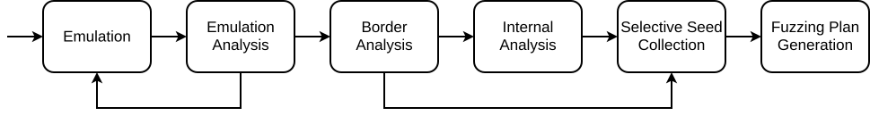
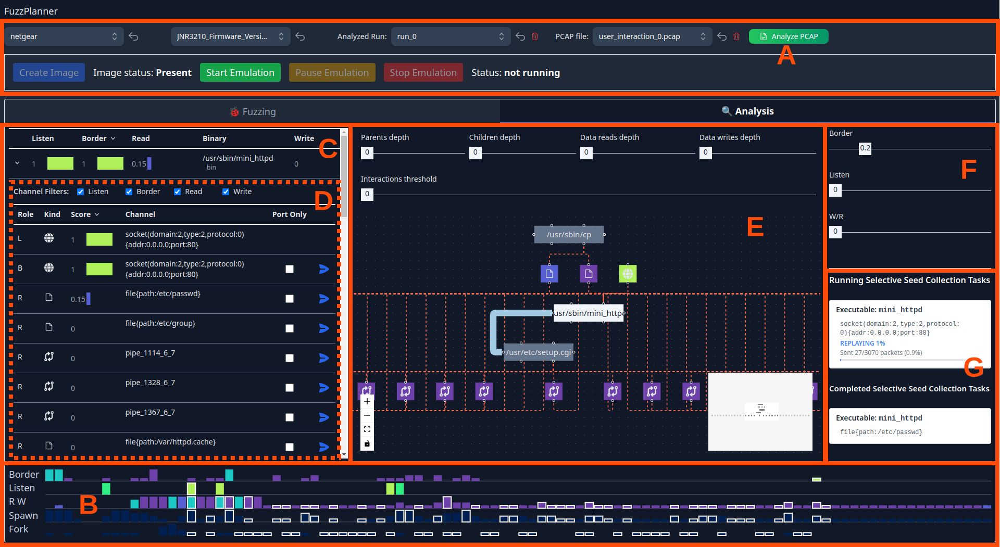
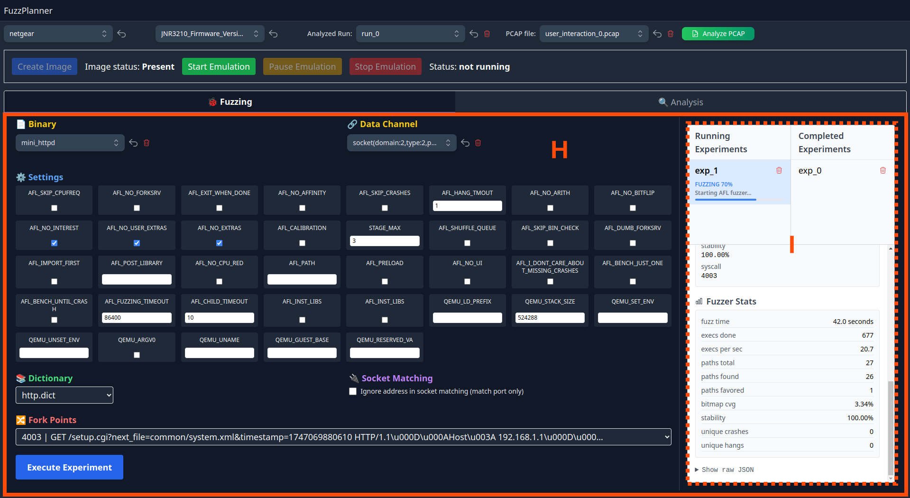

# FuzzPlanner

A visual analytics tool for designing and executing fuzzing campaigns on firmware. FuzzPlanner helps security researchers analyze firmware behavior, identify attack surfaces, and plan effective fuzzing strategies through an intuitive web interface.

## Overview

FuzzPlanner combines firmware emulation (based on FirmAE), dynamic analysis, and visualization to enable systematic fuzzing of IoT firmware. The tool provides:

- **Visual Analytics**: Interactive timeline, binary tables, and network graphs for comprehensive execution analysis
- **Target Discovery**: Automated identification of binary-channel pairs suitable for fuzzing
- **Campaign Management**: Configure and launch fuzzing experiments with AFL-based engines
- **Real-time Monitoring**: Track fuzzing progress with live statistics and crash detection

## Features

- **🔍 Firmware Analysis**: Analyze binary execution patterns and interactions during firmware emulation
- **📊 Visual Analytics**: Interactive timeline, binary tables, and network graphs for comprehensive analysis
- **🎯 Target Selection**: Identify optimal fuzzing targets based on data flows and vulnerabilities
- **⚡ Campaign Management**: Plan, execute, and monitor fuzzing experiments through a unified interface
- **📈 Progress Tracking**: Real-time monitoring of fuzzing progress with detailed statistics
- **🔧 FirmAFL Integration**: Modified AFL fuzzer optimized for firmware testing

## Quick Start

### Prerequisites

- **Docker** (required for containerized deployment)
- **Linux host system** (tested on Ubuntu/Debian)

### Installation

1. **Clone the repository**
   ```bash
   git clone <repository-url>
   cd FuzzPlanner
   ```

2. **Build and setup the Docker environment**
   ```bash
   ./setup.sh
   ```

   The setup script will automatically:
   - Build the Docker image with all dependencies
   - Install FirmAE for firmware emulation
   - Build FirmAFL (modified AFL for firmware)
   - Configure PostgreSQL database
   - Install Node.js and React frontend dependencies
   - Commit the configured image for future use

3. **Run the application**
   ```bash
   # Start the container
   ./docker.sh run

   # Attach to the container
   ./docker.sh attach

   # Inside the container, start the application
   ./start.sh
   ```

4. **Access the interface**
   - Frontend: http://localhost:3000

5. **Shutdown the application**
   - Press `Ctrl+C` to stop the application inside the container
   - Press `Ctrl+A` followed by `Ctrl+D` to detach from the container
   - Use `./docker.sh stop` to stop the container completely

## Workflow

FuzzPlanner follows a systematic six-phase approach for firmware fuzzing:



### Phase 1: Emulation
Extract and run firmware in a virtualized environment. The Emulation Panel manages the complete lifecycle from image preparation through interactive analysis sessions.

### Phase 2: Emulation Analysis
Review recorded firmware behavior through the GUI. Analyze execution traces to determine whether sufficient data has been gathered for fuzzing.

### Phase 3: Border Analysis
Identify border binaries—processes that receive input from external sources (network packets, files, etc.) without prior writes from other firmware processes. These represent Internet-facing attack surfaces.

### Phase 4: Internal Analysis
Examine multi-hop data transformations and inter-process communication. Trace data flows through the Binary Graph to understand how data propagates between binaries and identify vulnerabilities in processing chains.

### Phase 5: Selective Seed Collection
Automatically generate seed inputs by replaying recorded emulation sessions. Capture actual data (HTTP requests, DNS queries, IPC messages, file contents) transmitted on selected channels for each binary-channel pair.

### Phase 6: Fuzzing Plan Generation
Configure and launch fuzzing experiments using collected seeds. Set fuzzing parameters including dictionaries, timeout values, mutation strategies, and time budgets through the Experiment Launcher Panel.

## Usage

### Analysis View


The Analysis View provides comprehensive firmware analysis tools:
- **(A) Emulation Panel**: Unified control over firmware execution and interaction recording
- **(B) Timeline**: Chronological analysis with event aggregation capabilities
- **(C) Binary Table**: Sortable columns for binary comparison and statistics
- **(D) Binary Details Pane**: Data channels and I/O operations for each binary
- **(E) Binary Graph**: Visualization of inter-process communication (IPC)
- **(F) Filtering Pane**: Filter interactions by role and data channel scores
- **(G) Selective Seed Collection Pane**: Track running and completed seed collection attempts

### Fuzzing View


The Fuzzing View enables experiment management:
- **(H) Experiment Launcher Panel**: Configure fuzzing options and select fork points
- **(I) Experiment Details Pane**: Monitor current and finished experiments with holistic metrics

### Quick Usage Guide

1. **Upload & Emulate Firmware**
   - Upload firmware images (supports various formats)
   - Create firmware image and start emulation
   - Interact with the running firmware through the web interface

2. **Analyze Execution**
   - Use the Timeline to explore temporal behavior
   - Examine the Binary Table for execution statistics
   - Visualize data flows in the Binary Graph
   - Identify promising binary-channel pairs

3. **Collect Seeds**
   - Select target binary-channel pairs
   - Replay emulation to automatically capture input seeds
   - Review collected seeds for quality

4. **Launch Fuzzing Campaign**
   - Configure fuzzing parameters and dictionaries
   - Select appropriate fork points
   - Start experiments with real-time monitoring

5. **Monitor Results**
   - Track fuzzing progress with live statistics
   - Analyze discovered crashes and hangs
   - Export results for further investigation

## Troubleshooting

### Fuzzing Status Not Updating

If the fuzzing progress interface shows incorrect or stale status information:

1. **Check running containers**
   ```bash
   docker ps | grep fuzz
   ```

2. **Clean up stale containers**
   ```bash
   # Stop all fuzzing containers
   docker ps -a | grep fuzz | awk '{print $1}' | xargs docker stop
   docker ps -a | grep fuzz | awk '{print $1}' | xargs docker rm
   ```

3. **Restart the fuzzing experiment** - Launch the experiment again after cleanup

This issue occurs when the backend loses synchronization with the running Docker containers, causing the interface to display incorrect status information while the actual fuzzing process may still be active in the background.

### Firmware Image Creation Fails

If you encounter issues when creating a firmware image using the "Create Image" button, the FuzzPlanner container may have become unstable. To resolve this:

1. **Detach from the container**
   ```bash
   # Press Ctrl+A to detach from the container
   ```

2. **Restart the FuzzPlanner container**
   ```bash
   docker restart FuzzPlanner
   ```

3. **Reattach to the container**
   ```bash
   ./docker.sh attach
   ```

4. **Restart the application if needed**
   ```bash
   ./start.sh
   ```

This issue can occur when firmware extraction processes encounter errors or consume excessive resources, requiring a clean restart of the container environment.

## Key Components

### Analysis Modules
- **Timeline**: Temporal analysis of firmware execution showing when binaries are active
- **Binary Table**: Statistical overview of executed binaries with interaction metrics
- **Binary Graph**: Network visualization of binary interactions and data flows
- **Channel Analysis**: Identification of input/output channels for fuzzing

### Fuzzing Workflow
- **Target Picker**: Binary and data channel selection interface for choosing fuzzing targets
- **Experiment Launcher**: Fuzzing campaign configuration with custom dictionaries and parameters
- **Progress Monitor**: Real-time fuzzing statistics, crash detection, and result analysis

## Technology Stack

### Backend
- **Python 3**: Flask web server with REST API
- **PostgreSQL**: Database for firmware metadata and analysis results
- **Docker**: Container orchestration for fuzzing experiments
- **FirmAE**: Firmware emulation framework
- **FirmAFL**: Modified AFL fuzzer for firmware
- **PyShark/Scapy**: Network traffic analysis

### Frontend
- **React**: Modern UI framework
- **Next.js**: React framework for production
- **D3.js**: Interactive data visualizations
- **Cytoscape**: Network graph visualization

## Docker Management

The `docker.sh` script provides convenient commands:

```bash
./docker.sh build    # Build the Docker image
./docker.sh run      # Start the FuzzPlanner container
./docker.sh attach   # Attach to running container
./docker.sh stop     # Stop the container
./docker.sh restart  # Restart the container
```

## Project Structure

```
FuzzPlanner/
├── server_app.py           # Flask backend server and API endpoints
├── engine.py               # Execution analysis engine
├── scheduler.py            # Docker container orchestration
├── setup.sh                # Main installation script
├── start.sh                # Application startup script
├── docker.sh               # Docker management utility
├── webapp/                 # React frontend application
│   ├── src/components/     # Reusable UI components
│   ├── src/modules/        # Main application modules
│   │   ├── Timeline/       # Temporal execution visualization
│   │   ├── BinaryTable/    # Binary statistics table
│   │   ├── BinaryGraph/    # Binary interaction graph
│   │   ├── TargetPicker/   # Fuzzing target selection
│   │   ├── Experiment/     # Campaign configuration
│   │   └── Progress/       # Real-time monitoring
│   └── src/hooks/          # Custom React hooks
├── FirmAFL/                # Modified AFL for firmware fuzzing
├── FirmAE/                 # Firmware emulation framework
├── scripts/                # Analysis and utility scripts
└── config/                 # Configuration files
```

## Publication

This tool is based on research presented at VizSec 2023:

> Coppa, Emilio, Alessio Izzillo, Riccardo Lazzeretti e Simone Lenti. **"FuzzPlanner: Visually Assisting the Design of Firmware Fuzzing Campaigns."** *2023 IEEE Symposium on Visualization for Cyber Security (VizSec).* IEEE, 2023.

## Contributing

Contributions are welcome! Please feel free to submit issues or pull requests.

## Acknowledgments

- **DECAF**: Dynamic Executable Code Analysis Framework - https://github.com/decaf-project/DECAF
- **FirmAE**: Firmware emulation framework - https://github.com/pr0v3rbs/FirmAE
- **AFL**: American Fuzzy Lop fuzzer - https://github.com/google/AFL

## Contact

For questions or issues, please open an issue on GitHub or contact the authors through the publication.
